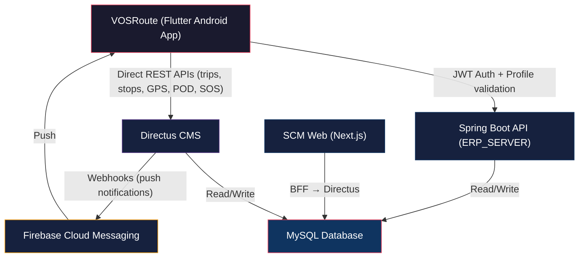

# 📱 VOSRoute — Fleet Dispatch Mobile App Documentation

> **Status**: Implemented & Active (Post-Restructure)
> **Date**: July 9, 2026
> **Scope**: Standalone Flutter mobile app (Android) for dispatched drivers, covering the full trip lifecycle from departure to proof of delivery and inbound return.
> **Reference**: Asset & Maintenance Documentation format standard

---

## 1. Module Overview

**VOSRoute** is a driver-facing mobile companion to the existing VOS Supply Chain Management (SCM) web dispatcher dashboard. It replaces manual paper-based delivery confirmation and radio check-ins with a structured mobile workflow that mirrors the `post_dispatch_plan` lifecycle managed in the SCM web app.

The app consolidates two previously separate concerns:
1. **Fleet Dispatch Workflow** — Full trip lifecycle management from departure to inbound return.
2. **Fleet Emergency (SOS)** — Absorbed from the existing `fleet-emergency-app`, providing drivers with an emergency reporting feature within the same app.

The app operates on an **offline-first** architecture. All trip data is cached locally upon dispatch assignment, and operations (GPS logging, photo capture, stop status updates) continue without connectivity. Data is synced back to the server when a stable connection is available.

---

## 2. Purpose

The purpose of VOSRoute is to provide drivers with a mobile tool for managing their dispatch assignments from departure to return.

Specifically, the app aims to:

- Allow drivers to view their assigned dispatch plans and route stops.
- Enable drivers to confirm departure and mark individual delivery stops as completed.
- Capture Proof of Delivery (POD) via mandatory photo attachments and optional customer signature.
- Record outbound and inbound cargo condition photos as trip-level proof.
- Track driver GPS location at regular intervals and store breadcrumb trails for dispatcher monitoring.
- Provide dispatchers/operators with semi-realtime driver location visibility on the SCM web dashboard.
- Allow drivers to add ad-hoc stops (fuel, rest, unplanned pickups) to their assigned route.
- Display allocated budget information (read-only) so drivers are aware of their trip allowances.
- Provide an SOS/emergency reporting feature (absorbed from the legacy `fleet-emergency-app`).
- Send push notifications via Firebase when new trips are assigned or statuses change.

---

## 3. Scope

### 3.1 Trip Dashboard

The app will display the driver's currently assigned dispatch plan(s) with status `For Dispatch`. The dashboard shows the trip document number, assigned vehicle plate, estimated departure/arrival times, budget summary, crew members (driver + helpers), and an overview of all route stops.

### 3.2 Route Stop Management

Drivers can view an ordered list of all stops for their active trip, including:
- **Customer Deliveries** (`post_dispatch_invoices`) — with customer name, invoice number, amount, and address/cluster.
- **Vendor Pick-ups** (`post_dispatch_purchases`) — with PO number, supplier, and items.
- **Other Stops** (`post_dispatch_plan_others`) — manual stops like fuel depots or rest areas.

Drivers can mark each stop's status and progress through the delivery sequence.

### 3.3 Proof of Delivery (POD)

For **customer delivery stops only** (`post_dispatch_invoices`), drivers are required to capture photographic evidence of the delivery. Signature capture is optional — the customer may sign on the device if willing, but it is not mandatory.

Stop status options:
- **Fulfilled** — Delivery completed successfully.
- **Not Fulfilled** — Delivery was not completed.
- **Fulfilled with Returns** — Partial delivery; some items returned.
- **Fulfilled with Concerns** — Delivery completed but with issues noted.

### 3.4 Outbound and Inbound Trip Photos

At the **trip level** (not per-stop), two mandatory photo sets are required:
- **Outbound Photos** — Captured at departure, documenting cargo condition as it leaves the warehouse.
- **Inbound Photos** — Captured upon return to base, documenting cargo/vehicle condition at arrival.

These photos are uploaded to Directus file storage and linked to the `post_dispatch_plan` via the `post_dispatch_trip_photos` table.

### 3.5 GPS Tracking

The app records the driver's GPS coordinates at **60-second intervals** while on an active trip. Coordinates are queued locally in SQLite and flushed to the Spring Boot server in batches when connectivity is available.

Dispatchers/operators can view driver locations on a map panel within the SCM web dashboard.

### 3.6 Ad-Hoc Stops

Drivers can add unplanned stops from the app (fuel depots, rest areas, unplanned pickups). These are recorded as new entries in `post_dispatch_plan_others` and synced to the server.

### 3.7 Budget View (Read-Only)

Drivers can view the allocated cash advances per COA (Chart of Accounts) budget line. This is a read-only view — expense logging and reconciliation remain on the web dispatcher side.

### 3.8 SOS / Emergency Reporting

The emergency reporting feature from the legacy `fleet-emergency-app` is absorbed into VOSRoute. Drivers can send distress signals, capture incident photos, and report emergencies — all within the same app. The existing `fleet_emergency_reports` Directus collection is reused.

### 3.9 Trip History

Drivers can view a list of past trips (`status = For Inbound | For Clearance | Posted`) with date, document number, and stop count. Tapping a trip shows a read-only summary.

### 3.10 Push Notifications (Firebase)

Firebase Cloud Messaging (FCM) is used for:
- **New trip assignment** — When a dispatcher marks a trip as `For Dispatch`, the driver receives a push notification.
- **Departure confirmation received** — Confirmation that the departure was logged.
- **Trip status changes** — Updates when trip status transitions occur (e.g., dispatcher changes).
- **SOS alert acknowledged** — When an operator acknowledges a driver's emergency report.

---

## 4. Delimitation

The app will focus on the driver's trip lifecycle, GPS tracking, proof of delivery, and emergency reporting.

The app will **not** directly perform the following:

- Expense logging or receipt capture — budget view is read-only; expense reconciliation stays on the SCM web dispatcher side.
- Trip creation, approval, or route sequencing — these are dispatcher/supervisor responsibilities on the SCM web.
- Final trip reconciliation — transitioning from `For Inbound` to `For Clearance` to `Posted` is handled by the dispatcher on the SCM web.
- Vehicle maintenance scheduling or motorpool job management.
- Customer account management or sales order creation.
- Automatic route optimization or re-sequencing of stops.
- Direct database access — all operations go through Spring Boot API or Directus file upload API.
- iOS support — the app targets Android only for the initial release.

---

## 5. Target Users

### Driver

The primary user. Receives dispatch assignments, views route stops, captures proof of delivery, logs GPS location, reports emergencies, and confirms trip completion.

### Helper / Co-Driver

A secondary crew member assigned to the trip via `post_dispatch_plan_staff`. Helpers may use the app to view trip details but are not the primary operator. The driver remains the authoritative user for status updates.

### Dispatcher / Operator (Web)

Monitors driver locations on the SCM web dashboard map panel. Views POD submissions, GPS trails, and trip status. Manages trip lifecycle transitions on the web.

### Fleet Supervisor (Web)

Reviews trip history, POD evidence, and GPS data. Oversees the overall fleet dispatch operation from the SCM web.

### System Admin

Manages user accounts, driver assignments, vehicle registrations, and system configuration in Directus and the VOS web platform.

---

## 6. Architecture

### 6.1 High-Level Architecture



### 6.2 Data Flow Summary

| Operation | Flow |
|---|---|
| **Authentication** | App → `POST /auth/login` → Spring Boot → JWT returned |
| **Fetch Active Trip** | App → `GET /items/post_dispatch_plan` → Directus → MySQL |
| **GPS Log Batch** | App (SQLite queue) → `POST /items/post_dispatch_gps_logs` → Directus → MySQL |
| **Stop Status Update** | App → `PATCH /items/post_dispatch_invoices/{id}` → Directus → MySQL |
| **POD Photo Upload** | App → `POST /files` → Directus → UUID returned → App → `POST /items/post_dispatch_nte` → Directus → MySQL |
| **Trip Photo Upload** | App → `POST /files` → Directus → UUID returned → App → `POST /items/post_dispatch_trip_photos` → Directus → MySQL |
| **Ad-Hoc Stop** | App → `POST /items/post_dispatch_plan_others` → Directus → MySQL |
| **Confirm Departure** | App → `PATCH /items/post_dispatch_plan/{id}` → Directus → MySQL |
| **Mark Arrived at Base** | App → `PATCH /items/post_dispatch_plan/{id}` → Directus → MySQL (`status = For Clearance`) |
| **SOS Report** | App → `POST /items/fleet_emergency_reports` → Directus → MySQL |
| **Push Notification** | Status changes on Directus → Webhooks → FCM → App |
| **Dispatcher Views GPS** | SCM Web → Next.js BFF → Directus → MySQL (reads `post_dispatch_gps_logs`) |

### 6.3 Backend Ownership

| Domain | Backend | Protocol |
|---|---|---|
| Auth (login, refresh, user profile) | Spring Boot | JWT Bearer |
| Active trip read / trip history | Directus | Static Token |
| GPS log writes | Directus | Static Token |
| Stop status updates | Directus | Static Token |
| Trip arrival / departure confirmation | Directus | Static Token |
| Ad-hoc stop creation | Directus | Static Token |
| Emergency / SOS reports | Directus | Static Token |
| File uploads (photos, signatures) | Directus | Static Token |
| NTE attachment linking | Directus | Static Token |
| Push notifications | Firebase (FCM) via Directus Webhooks | Server key |
| Web dispatcher GPS map / POD viewer | Next.js BFF → Directus | Static Token |

### 6.4 Network Configuration

**Development**: Tailscale VPN mesh network.
- Spring Boot: `http://100.105.235.94:8082`
- Directus: `http://100.110.197.61:8056`

**Production**: Tailscale will be used for production drivers as well (current plan). Public hosting will be evaluated in a future phase.

The app will support auto-discovery of the backend URLs, similar to the pattern used in `fleet-emergency-app`.

---

## 7. Main System Flow

### Step 1: Driver Logs In

The driver opens VOSRoute and enters their VOS credentials (email + password). The app authenticates against Spring Boot's `/auth/login` endpoint, receives a JWT (`vos_access_token`), and caches it locally in `SharedPreferences` for offline resume.

---

### Step 2: Driver Receives Trip Assignment

When a dispatcher marks a trip as `For Dispatch` on the SCM web, Spring Boot triggers a Firebase Cloud Messaging push notification to the driver's registered device.

The driver taps the notification → VOSRoute opens → the app fetches the full trip payload from Spring Boot and caches it in the local SQLite database for offline use.

---

### Step 3: Driver Reviews Trip Details

The home screen displays the active trip dashboard:
- Trip document number (`doc_no`)
- Assigned vehicle plate
- Estimated dispatch and arrival times
- Budget summary (read-only)
- Crew (driver + helpers)
- Total number of stops and overall route summary

---

### Step 4: Driver Captures Outbound Photos

Before departing, the driver takes mandatory photos documenting the cargo condition at the warehouse. These photos are:
1. Captured via the device camera.
2. Uploaded to Directus file storage (returns UUID).
3. Linked to the trip via `post_dispatch_trip_photos` with `type = 'outbound'`.

---

### Step 5: Driver Confirms Departure

The driver taps "Confirm Departure" in the app. This:
- Triggers `PUT /api/dispatch/plan/{id}/en-route` on Spring Boot.
- Records `time_of_dispatch` on the `post_dispatch_plan`.
- Activates GPS tracking at 60-second intervals.
- All GPS coordinates are queued in local SQLite and flushed to Spring Boot when online.

---

### Step 6: Driver Works Through Route Stops

The driver follows the sequenced list of stops. For each **customer delivery stop**:
1. **Navigate** to the stop location.
2. **Mark Arrived** — timestamps the arrival.
3. **Deliver goods** to the customer.
4. **Capture POD** — take mandatory photos of the delivery receipt or cargo condition. Optionally capture customer signature.
5. **Mark Stop Status** — choose from: Fulfilled, Not Fulfilled, Fulfilled with Returns, Fulfilled with Concerns.
6. **Add Concern Note** — free-text field for partial delivery, damage, or refusal details.

Photos are uploaded to Directus and linked via `post_dispatch_nte`. Stop status is updated via Spring Boot.

For **vendor pick-up stops** and **other stops**: the driver views details and marks status (no POD photo required).

---

### Step 7: Driver Adds Ad-Hoc Stops (Optional)

If needed, the driver can add unplanned stops (fuel depot, rest area, etc.) directly from the app. These create new `post_dispatch_plan_others` records via Spring Boot.

---

### Step 8: All Stops Completed — Return to Base

After completing all stops, the driver navigates back to the starting point (base branch).

---

### Step 9: Driver Captures Inbound Photos

Upon return, the driver takes mandatory photos documenting the cargo/vehicle condition. These are uploaded to Directus and linked via `post_dispatch_trip_photos` with `type = 'inbound'`.

---

### Step 10: Driver Marks "Arrived at Base"

The driver taps "Arrived at Base" in the app. This:
- Triggers `PATCH /api/dispatch/mobile/arrive` on Spring Boot.
- Records `time_of_arrival` on the `post_dispatch_plan`.
- Sets trip status to `For Inbound`.
- Stops GPS tracking.

---

### Step 11: Dispatcher Handles Clearance and Posting (Web)

The remaining trip lifecycle happens on the SCM web:
- **For Clearance** — Vehicle inspection check after inbound.
- **Posted** — Trip fully reconciled and closed.

These transitions are **not** available in the mobile app.

---

## 8. Trip Status Flow

The `post_dispatch_plan.status` follows this lifecycle:

```
[For Approval]       ← Created by dispatcher (web)
      ↓
[For Dispatch]       ← Approved by supervisor (web) — Driver sees trip in VOSRoute
      ↓
  Driver confirms departure → time_of_dispatch recorded, GPS tracking starts
      ↓
  Driver works through stops → per-stop status updates
      ↓
  All stops done → Driver returns to base
      ↓
[For Inbound]        ← Driver taps "Arrived at Base" in VOSRoute
      ↓
[For Clearance]      ← Vehicle inspection (web)
      ↓
[Posted]             ← Trip reconciled and closed (web)

[Cancelled]          ← Trip can be cancelled at any point (web only)
```

### Driver-Permitted Actions

| Action | Status Transition | Where |
|---|---|---|
| Confirm Departure | (none — records `time_of_dispatch`) | VOSRoute |
| Mark Stop as Fulfilled / Not Fulfilled / etc. | Per-stop status update | VOSRoute |
| Add Ad-Hoc Stop | Creates new stop record | VOSRoute |
| Mark Arrived at Base | `For Dispatch` → `For Inbound` | VOSRoute |
| Capture POD Photos | (no status change) | VOSRoute |
| Capture Outbound/Inbound Photos | (no status change) | VOSRoute |
| Report Emergency (SOS) | Creates emergency record | VOSRoute |

### Dispatcher-Only Actions

| Action | Status Transition | Where |
|---|---|---|
| Create trip | → `For Approval` | SCM Web |
| Approve trip | `For Approval` → `For Dispatch` | SCM Web |
| Vehicle clearance | `For Inbound` → `For Clearance` | SCM Web |
| Final reconciliation | `For Clearance` → `Posted` | SCM Web |
| Cancel trip | → `Cancelled` | SCM Web |

---

## 9. Stop Status Flow

For customer delivery stops (`post_dispatch_invoices`):

```
[Pending]              ← Initial state
      ↓
[In Progress]          ← Driver arrived at stop
      ↓
[Fulfilled]            ← Delivery completed successfully
[Not Fulfilled]        ← Delivery failed
[Fulfilled with Returns]    ← Partial delivery, some items returned
[Fulfilled with Concerns]   ← Completed with noted issues
```

---

## 10. Data Model

### 10.1 Existing Collections (No Schema Changes)

| Collection | Used For | Key Fields |
|---|---|---|
| `post_dispatch_plan` | Active trip header | `id`, `doc_no`, `driver_id`, `vehicle_id`, `encoder_id`, `starting_point`, `status`, `total_distance`, `amount`, `estimated_time_of_dispatch`, `estimated_time_of_arrival`, `time_of_dispatch`, `time_of_arrival`, `date_encoded`, `remarks` |
| `post_dispatch_plan_staff` | Trip crew junction | `post_dispatch_plan_id`, `user_id`, `role` |
| `post_dispatch_dispatch_plans` | Pre-dispatch to post-dispatch link | `id`, `post_dispatch_plan_id`, `dispatch_plan_id`, `linked_at`, `linked_by` |
| `post_dispatch_budgeting` | Trip budget lines | `id`, `post_dispatch_plan_id`, `coa_id`, `remarks`, `amount` |
| `post_dispatch_invoices` | Customer delivery stops | `id`, `post_dispatch_plan_id`, `invoice_id`, `distance`, `status`, `sequence`, `invoiceAt`, `isCleared`, `remarks` |
| `post_dispatch_purchases` | Vendor pick-up stops | `id`, `post_dispatch_plan_id`, `po_id`, `distance`, `sequence`, `status` |
| `post_dispatch_plan_others` | Manual/ad-hoc stops | `id`, `post_dispatch_plan_id`, `remarks`, `distance`, `sequence`, `status` |
| `post_dispatch_nte` | Per-stop file attachments (POD) | `id`, `doc_no`, `post_dispatch_invoice_id`, `file` (Directus file UUID), `created_at`, `created_by` |
| `post_dispatch_invoices_serial` | Serial number tracking per invoice | `id`, `post_dispatch_invoice_id`, `product_id`, `serial_number`, `created_by`, `updated_by`, `created_at`, `updated_at` |
| `vehicles` | Vehicle registry | `vehicle_id`, `vehicle_plate`, `name`, `status`, `current_mileage`, etc. |
| `branches` | Branch locations | `id`, `branch_name`, `isReturn`, etc. |
| `user` | User/driver profiles | `user_id`, `user_fname`, `user_lname`, `user_email`, `user_contact`, etc. |
| `sales_invoice` | Invoice details for delivery stops | `invoice_id`, `customer_code`, `invoice_no`, `total_amount`, `salesman_id`, `branch_id`, etc. |
| `fleet_emergency_reports` | SOS/emergency incidents | `id`, `report_no`, `incident_type`, `severity`, `status`, `vehicle_id`, `driver_user_id`, `dispatch_plan_id`, `latitude`, `longitude`, etc. |

### 10.2 New Table: `post_dispatch_gps_logs`

Stores the driver GPS breadcrumb trail per trip.

| Field | Type | Notes |
|---|---|---|
| `id` | integer | PK, auto-increment |
| `post_dispatch_plan_id` | integer | FK → `post_dispatch_plan.id` |
| `driver_user_id` | integer | FK → `user.user_id` |
| `latitude` | decimal(10,7) | GPS latitude |
| `longitude` | decimal(10,7) | GPS longitude |
| `accuracy` | decimal(6,2) | GPS accuracy in meters |
| `speed` | decimal(6,2) | Speed in m/s (nullable) |
| `heading` | decimal(5,2) | Compass heading in degrees (nullable) |
| `recorded_at` | datetime | Time the coordinate was recorded on the device (PHT UTC+8) |
| `created_at` | datetime | Time the server received the record |

**Volume estimate**: 60-second intervals × 8-hour trip = ~480 points/trip. With 20 active drivers daily = ~9,600 points/day (~3.5M/year). MySQL handles this comfortably.

**Indexes**: `post_dispatch_plan_id`, `driver_user_id`, `recorded_at`.

### 10.3 New Table: `post_dispatch_trip_photos`

Stores outbound and inbound cargo photos at the trip level.

| Field | Type | Notes |
|---|---|---|
| `id` | integer | PK, auto-increment |
| `post_dispatch_plan_id` | integer | FK → `post_dispatch_plan.id` |
| `file` | uuid/string | Directus file UUID |
| `type` | enum | `'outbound'`, `'inbound'` |
| `created_at` | datetime | Upload timestamp |
| `created_by` | integer | FK → `user.user_id` (driver) |

Multiple photos per type are supported (e.g., multiple outbound photos showing different cargo views).

---

## 11. Directus REST API & Queries

VOSRoute communicates directly with Directus via its standard REST endpoints using the static token `AAKv73dkIV8DfAIA5vEt3eXVdIebzmBW` (configured in the app).

### 11.1 Fetching Active Trip (With nested invoice details)

The app fetches the driver's active trip and enriched invoice info directly using nested Directus relations. This allows VOSRoute to read fields like `order_status` on the linked `sales_invoice` record.

**Endpoint**: `GET /items/post_dispatch_plan`
**URL Parameters**:
- `filter[driver_id][_eq]`: Logged-in driver user ID.
- `filter[status][_in]`: `For Dispatch,For Inbound`
- `fields`: `*,post_dispatch_plan_staff.*,post_dispatch_invoices.*,post_dispatch_invoices.invoice_id.*,post_dispatch_purchases.*,post_dispatch_plan_others.*,post_dispatch_budgeting.*`

This fetches:
- Trip header info (total distance, starting branch, plate).
- Crew list (`post_dispatch_plan_staff`).
- Budgets (`post_dispatch_budgeting`).
- Sequences of customer deliveries (`post_dispatch_invoices`), automatically nesting details from the invoice table (`sales_invoice`), including customer code, invoice no, total amount, and its operational **`order_status`** column.

### 11.2 Confirming Departure

Driver departs base. The app logs this by patching the active post dispatch plan. The status is transitioned to **`For Inbound`** and stores `time_of_dispatch`, `driver_id`, and departure `remarks`.

**Endpoint**: `PATCH /items/post_dispatch_plan/{planId}`
**Payload**:
```json
{
  "time_of_dispatch": "2026-07-03T14:00:00+08:00",
  "status": "For Inbound",
  "remarks": "Outbound cargo checked and approved."
}
```

*Note: In the SCM Web app, dispatching also updates related sales orders to `En Route` and sales invoices to `En Route` (setting `isDispatched: 1`). The mobile app performs these updates directly via standard Directus mutations:*
- Patch `/items/sales_invoice` filter matching `invoice_id` to set `transaction_status: "En Route"`, `isDispatched: 1`, and `dispatch_date`.
- Patch `/items/sales_order` filter matching `order_no` to set `order_status: "En Route"`.


### 11.3 Stop Status Updates

Updates individual delivery, PO, or custom stops.

**Endpoint**: `PATCH /items/post_dispatch_invoices/{stopId}`
**Payload**:
```json
{
  "status": "Fulfilled",
  "invoiceAt": "2026-07-03T14:15:00+08:00",
  "remarks": ""
}
```

### 11.4 Uploading & Linking POD Attachments (NTE)

For customer stops, photos are uploaded to `/files` in Directus, and then linked to the stop.

**Endpoint**: `POST /items/post_dispatch_nte`
**Payload**:
```json
{
  "post_dispatch_invoice_id": 3,
  "file": "directus-file-uuid",
  "doc_no": "INV-100234"
}
```

### 11.5 Uploading Outbound/Inbound Trip Photos

Links cargo condition photos at departure and arrival.

**Endpoint**: `POST /items/post_dispatch_trip_photos`
**Payload**:
```json
{
  "post_dispatch_plan_id": 1,
  "file": "directus-file-uuid",
  "type": "outbound"
}
```

### 11.6 Creating Ad-Hoc Stops

Creates unplanned rest/fuel stops on the active trip.

**Endpoint**: `POST /items/post_dispatch_plan_others`
**Payload**:
```json
{
  "post_dispatch_plan_id": 1,
  "remarks": "Fuel replenishment stop",
  "distance": 8.0,
  "sequence": 5,
  "status": "Fulfilled"
}
```

### 11.7 Arriving at Base (Confirming Arrival)

Driver returns to warehouse. Sets status to **`For Clearance`** (saving arrival `remarks_arrival` and `time_of_arrival`) which halts GPS tracking.

**Endpoint**: `PATCH /items/post_dispatch_plan/{planId}`
**Payload**:
```json
{
  "status": "For Clearance",
  "time_of_arrival": "2026-07-03T18:30:00+08:00",
  "remarks_arrival": "Returns checked by warehouse supervisor."
}
```

### 11.8 Reporting Emergency (SOS Distress)

Sends emergency reports to the standard collection.

**Endpoint**: `POST /items/fleet_emergency_reports`
**Payload**:
```json
{
  "report_no": "SOS-12345",
  "incident_type": "breakdown",
  "severity": "high",
  "status": "reported",
  "vehicle_id": 12,
  "driver_user_id": 34,
  "dispatch_plan_id": 1,
  "latitude": 14.1234567,
  "longitude": 121.1234567,
  "description": "Engine overheating, smoking on highway.",
  "occurred_at": "2026-07-03T14:50:00+08:00"
}
```

Since Spring Boot is bypassed for operations, Firebase Push Notifications are triggered directly from **Directus Webhooks**. 
- In Directus settings, Webhooks can be configured to fire on events (e.g. `items.update` for `post_dispatch_plan` when `status` transitions to `For Dispatch`).
- The Webhook payload is forwarded to a lightweight Node.js or Directus custom endpoint wrapper which resolves the target driver's token and sends the message using Firebase Admin SDK.

---

## 12. Directus File Upload

The mobile app uploads files directly to Directus for:
- POD photos (per-stop)
- Outbound/inbound trip photos
- Customer signatures (saved as image)
- Emergency incident photos

### Upload Flow

```
1. App captures photo via camera → stores locally
2. App uploads to Directus: POST {DIRECTUS_URL}/files (multipart/form-data)
   Header: Authorization: Bearer {DIRECTUS_STATIC_TOKEN}
   Body: file binary
3. Directus returns: { id: "uuid-of-file", ... }
4. App sends UUID to Directus endpoint to link the file to the appropriate record (e.g. `/items/post_dispatch_nte` or `/items/post_dispatch_trip_photos`)
```

### Directus Configuration

- **Base URL**: `http://100.110.197.61:8056` (Tailscale)
- **Auth**: `DIRECTUS_STATIC_TOKEN` for file uploads (server-to-server pattern)
- **File folder**: `post_dispatch_nte` (for POD attachments) — already exists in Directus

---

## 13. Offline-First Architecture

### 13.1 Strategy: Cache-on-Dispatch

When the app detects a new `For Dispatch` trip (via FCM push or polling on app open), it downloads the **full trip payload** into the local SQLite database:

```
Local SQLite Tables:
  cached_trips           — full post_dispatch_plan + stops + budget + crew
  gps_queue              — pending GPS coordinates awaiting server flush
  pod_queue              — pending POD submissions (file UUIDs + stop IDs)
  trip_photo_queue       — pending trip photo links (outbound/inbound)
  ad_hoc_stop_queue      — pending ad-hoc stop creations
  emergency_queue        — pending SOS reports
  cached_driver_profile  — driver + vehicle context
```

### 13.2 Sync on Reconnect

A background service monitors connectivity. On reconnect:

1. **Flush `gps_queue`** → `POST /items/post_dispatch_gps_logs` (creates coordinate logs).
2. **Upload queued photos** → `POST /files` to Directus → get UUID.
3. **Flush `pod_queue`** → `POST /items/post_dispatch_nte` (links POD to stops).
4. **Flush `trip_photo_queue`** → `POST /items/post_dispatch_trip_photos` (links outbound/inbound photos).
5. **Flush `ad_hoc_stop_queue`** → `POST /items/post_dispatch_plan_others` (creates custom stops).
6. **Flush `emergency_queue`** → `POST /items/fleet_emergency_reports` (creates SOS reports).
7. **Refetch trip state** from Directus (`GET /items/post_dispatch_plan`) to reconcile dispatcher changes.

### 13.3 Conflict Resolution

- **Driver is authoritative** for stop-level status changes and POD submissions.
- **Dispatcher is authoritative** for trip-level status transitions.
- If a stop was already marked by a dispatcher while the driver was offline, the app shows the dispatcher's status but does not overwrite it without driver confirmation.
- GPS logs are append-only — no conflict possible.

---

## 14. Technology Stack

### 14.1 Mobile App (Flutter)

| Layer | Choice | Notes |
|---|---|---|
| Framework | **Flutter** (Dart) | Consistent with existing `fleet-emergency-app` |
| Platform | **Android only** | Driver devices are Android |
| HTTP Client | **Dio** | Reuse auth interceptor pattern from `fleet-emergency-app` |
| Local Database | **SQLite via `sqflite`** | Structured offline queues, trip cache, GPS logs |
| State Management | **`provider`** | Simple, team-familiar, sufficient for app scope |
| Maps | **`flutter_map` + OpenStreetMap** | Lightweight; no API key needed; renders stop markers + GPS trace |
| Signature Capture | **`signature` package** | Canvas-based in-app customer signature capture (optional) |
| Camera | **`image_picker`** | Reuse from `fleet-emergency-app` for photo capture |
| Background Service | **`flutter_background_service`** | Reuse from `fleet-emergency-app` for GPS ping and queue flush |
| Push Notifications | **`firebase_messaging`** | FCM for trip assignment and status notifications |
| Geolocation | **`geolocator`** | GPS coordinate stream |
| Icons | Material Design | `cupertino_icons` + `uses-material-design: true` |

### 14.2 Backend

| Layer | Choice | Notes |
|---|---|---|
| Auth Server | **Spring Boot** (`ERP_SERVER`) | Reused solely for username/password authentication & token issuance |
| Data/API Server | **Directus CMS** | Standard REST API queries/mutations for all operational data |
| Database | **MySQL** | Directus handles mapping collections to tables automatically |
| File Storage | **Directus CMS** | Handles binary file uploads, thumbnails, and UUID serving |
| Push Notifications | **Firebase Admin SDK** | Triggered via Directus Webhooks pointing to a Node/Firebase gateway |

---

## 15. Project Folder Structure

```
VOSRoute/
├── AGENTS.md                        # Agent conventions for this project
├── docs/
│   └── VOSRoute-Documentation.md    # This document
├── pubspec.yaml
└── lib/
    ├── main.dart                    # App entry, routing, theme, backend auto-discovery
    ├── config/
    │   └── app_config.dart          # Backend URLs, intervals, feature flags
    ├── models/
    │   ├── trip.dart                # PostDispatchPlan, crew, vehicle, budget
    │   ├── stop.dart                # InvoiceStop, PurchaseStop, OtherStop
    │   ├── gps_log.dart             # GpsPoint, GpsQueue
    │   ├── pod.dart                 # ProofOfDelivery, NteAttachment
    │   ├── trip_photo.dart          # TripPhoto (outbound/inbound)
    │   ├── emergency_report.dart    # Reuse/extend from fleet-emergency-app
    │   └── driver_profile.dart      # Reuse/extend from fleet-emergency-app
    ├── screens/
    │   ├── login_screen.dart        # Spring Boot JWT auth
    │   ├── home_screen.dart         # Active trip dashboard
    │   ├── stops_screen.dart        # Ordered stop list
    │   ├── stop_detail_screen.dart  # Per-stop POD capture + status update
    │   ├── map_screen.dart          # GPS trace + stops map view
    │   ├── budget_screen.dart       # Read-only budget view
    │   ├── trip_photos_screen.dart  # Outbound/inbound photo capture
    │   ├── history_screen.dart      # Past trips
    │   ├── sos_screen.dart          # Emergency SOS (from fleet-emergency-app)
    │   └── settings_screen.dart     # Backend URL config, GPS interval, etc.
    ├── services/
    │   ├── api_service.dart         # Dio client, Spring Boot requests
    │   ├── auth_service.dart        # Login, JWT persistence, refresh
    │   ├── sync_service.dart        # Offline queue flush, connectivity watch
    │   ├── gps_service.dart         # Geolocator stream, queue management
    │   ├── upload_service.dart      # Directus file upload (multipart)
    │   ├── notification_service.dart # FCM token registration + handling
    │   └── emergency_service.dart   # SOS report API calls
    ├── db/
    │   ├── database.dart            # SQLite init, schema, migrations
    │   ├── trip_dao.dart            # CRUD for cached trip payload
    │   └── queue_dao.dart           # CRUD for GPS/POD/photo/emergency queues
    ├── providers/
    │   ├── trip_provider.dart       # Active trip state
    │   ├── sync_provider.dart       # Sync status state
    │   ├── gps_provider.dart        # GPS tracking state
    │   └── auth_provider.dart       # Auth state
    └── widgets/
        ├── stop_card.dart           # Reusable stop list item
        ├── signature_pad.dart       # Canvas-based signature capture
        ├── photo_capture_sheet.dart  # Camera bottom sheet
        ├── status_chip.dart         # Stop status indicator
        └── sync_indicator.dart      # Online/offline/syncing status bar
```

---

## 16. UI/UX Design

### 16.1 Design Direction

- **Theme**: Dark mode with high-contrast elements, optimized for driver use during long drives and delivery operations.
- **Inspiration**: Navigation apps (Google Maps, Waze) — familiar large-button interfaces that drivers already know.
- **Touch Targets**: Minimum 48dp for all interactive elements; critical actions (Confirm Departure, Mark Completed) use larger buttons.
- **Typography**: Clear, readable fonts at large sizes. Status indicators use color-coded chips.
- **Colors**: VOS brand colors adapted for dark theme with high-contrast accents.

### 16.2 Navigation

Bottom navigation bar with 5 primary tabs:

| Tab | Icon | Screen |
|---|---|---|
| **Home** | 🏠 | Driver Performance Overview (Pie Chart) & Pending Queue |
| **Dispatch Plans** | 📋 | Active Dispatch Plan Details & Transition Controls |
| **Stops** | 📍 | Sequence list of Delivery / PO / Other stops with signature validation |
| **Map** | 🗺️ | GPS track & interactive stop markers with OpenFreeMap tiles |
| **More** | ☰ | Budget, History, SOS, Settings |

### 16.3 Key UI Patterns

- **Status Cards**: Large colored cards showing trip status, next stop, and sync status.
- **Pull-to-Refresh**: On home and stops screens to manually fetch latest data.
- **Confirmation Modals**: All critical actions (Confirm Departure, Mark Arrived, SOS) require explicit confirmation dialogs to prevent accidental triggers.
- **Offline Indicator**: Persistent banner showing online/offline/syncing status.
- **Photo Thumbnails**: Captured photos shown as thumbnails with tap-to-expand.
- **Progress Bar**: Visual progress showing completed stops out of total.

---

## 17. Phased Implementation Plan

### Phase 1 — Core Trip View (MVP)

**Goal**: Driver can log in, see their active trip, view stops, and track GPS.

| Feature | Details |
|---|---|
| Login | Spring Boot JWT auth, token persistence |
| Active Trip Dashboard | Fetch and display active trip from Spring Boot |
| Stop List View | Display ordered stops (read-only, no status updates yet) |
| Basic GPS Tracking | 60-second interval, online-only flush |
| Firebase Push Notifications | FCM device registration, trip assignment notifications |
| Backend Auto-Discovery | Tailscale URL configuration |

**Verification**: Driver logs in → sees active trip → stop list loads → GPS pings appear in `post_dispatch_gps_logs` table.

---

### Phase 2 — POD & Stop Completion

**Goal**: Driver can complete stops with photo proof and update statuses.

| Feature | Details |
|---|---|
| Stop Detail Screen | Per-stop view with customer/invoice info |
| Stop Status Updates | Mark as Fulfilled / Not Fulfilled / etc. |
| POD Photo Capture | Camera capture → Directus upload → NTE link |
| Optional Signature | Canvas-based signature capture |
| Outbound/Inbound Trip Photos | Mandatory cargo photos at departure and return |
| Confirm Departure | Triggers `en-route` on Spring Boot |
| Mark Arrived at Base | Sets trip to `For Inbound` |
| Ad-Hoc Stops | Add fuel/rest stops from the app |

**Verification**: Full trip lifecycle works from departure → stops → return. POD photos visible in Directus. Stop statuses updated in DB.

---

### Phase 3 — Full Offline-First + SOS

**Goal**: App works fully offline with background sync. SOS feature absorbed.

| Feature | Details |
|---|---|
| SQLite Local Database | Full trip payload cache with migrations |
| Offline Queues | GPS, POD, trip photos, ad-hoc stops all queue in SQLite |
| Background GPS Service | GPS continues when app is backgrounded |
| Background Sync | Auto-flush queues on reconnect |
| SOS/Emergency Feature | Port from `fleet-emergency-app` (screens, models, services) |
| Trip History | View past trips (read-only summaries) |

**Verification**: Turn off connectivity → complete a full trip → reconnect → all data syncs to server. SOS report submits successfully.

---

### Phase 4 — SCM Web Integration

**Goal**: Dispatchers can see driver GPS and POD data on the SCM web dashboard.

| Feature | Details |
|---|---|
| GPS Map Panel | Leaflet map on For Dispatch / Logistics Summary page showing latest driver GPS per active trip |
| POD Viewer | In trip detail view on web, show per-stop POD status, photo thumbnails, and signature |
| Trip Photo Viewer | Show outbound/inbound cargo photos in the trip detail view |
| Read-Only Budget vs. Actual (Future) | Placeholder for future expense logging comparison |

**Verification**: Active trip GPS trail visible on SCM web map. POD photos visible in trip detail.

---

## 18. SCM Web Integration (Phase 4 Detail)

### 18.1 GPS Map Panel

**Location**: New map component on the Logistics Summary or For Dispatch page in the SCM web app.

**Data Source**: The SCM web's Next.js BFF reads `post_dispatch_gps_logs` from Directus (same MySQL database). A new BFF route at `/api/scm/fleet-management/dispatch-mobile/gps-trail` returns the latest GPS coordinates per active trip.

**Behavior**:
- Shows all currently `For Dispatch` trips as markers on a Leaflet/OpenStreetMap map.
- Each marker shows vehicle plate, driver name, and last update time.
- Map refreshes via polling every 30 seconds (configurable).
- Clicking a marker shows the full GPS breadcrumb trail for that trip.

### 18.2 POD Viewer

**Location**: Within the existing trip detail view on the SCM web (likely the Inbound Reconcile page).

**Data Source**: Reads `post_dispatch_nte` records linked to the trip's `post_dispatch_invoices`. File thumbnails fetched from Directus.

**Behavior**:
- Per-stop: shows POD status chip + photo thumbnails + signature image (if captured).
- Clicking a photo opens full-size in a modal.
- Shows concern notes if any.

### 18.3 Trip Photo Viewer

**Location**: Within the trip detail view on the SCM web.

**Data Source**: Reads `post_dispatch_trip_photos` for the trip.

**Behavior**:
- Shows outbound photos in a gallery labeled "Departure Cargo Condition".
- Shows inbound photos in a gallery labeled "Return Cargo Condition".
- Side-by-side comparison view for easy verification.

---

## 19. Firebase Cloud Messaging Setup

### 19.1 Mobile App (Client-Side)

- On login, the app requests FCM permission and retrieves the device token.
- The token is sent to Spring Boot via `POST /api/dispatch/mobile/register-device`.
- On token refresh, the app re-registers with the server.
- Notification handling: foreground → in-app banner; background → system notification.

### 19.2 Spring Boot (Server-Side)

- Firebase Admin SDK dependency added to `pom.xml`.
- Service account JSON stored securely (environment variable or config).
- New `NotificationService` class handles sending FCM messages.
- Triggered by dispatcher actions on the SCM web (status changes).

### 19.3 Notification Events

| Event | Trigger | Recipient | Notification Content |
|---|---|---|---|
| Trip Assigned | Dispatcher marks trip `For Dispatch` | Assigned driver | "New trip assigned: {doc_no}. Tap to view details." |
| Departure Confirmed | Driver taps Confirm Departure | Dispatcher (future) | "Driver {name} departed for trip {doc_no}." |
| Status Changed | Any trip status change (web) | Assigned driver | "Trip {doc_no} status updated to {new_status}." |
| SOS Acknowledged | Operator acknowledges SOS | Reporting driver | "Your emergency report {report_no} has been acknowledged." |

---

## 20. Relation to Existing Apps

| App | Relationship |
|---|---|
| `fleet-emergency-app` | Legacy Flutter app — code absorbed into VOSRoute. The old folder will eventually be deprecated. Reuse: auth interceptor, upload service, BFF auto-discovery, offline queue patterns, SOS screens/models/services. |
| `supply-chain-management` (Next.js) | Shares the same MySQL database (via Directus). Phase 4 adds GPS map panel and POD viewer to the SCM web dispatcher views. Existing BFF routes are not used by the mobile app (mobile goes through Spring Boot directly). |
| `ERP_SERVER` (Spring Boot) | The primary backend for VOSRoute. Existing auth and dispatch controllers are reused. New `DispatchMobileController` and supporting services/entities/repositories are needed for mobile-specific endpoints. |

---

## 21. Open Questions / Future Considerations

| # | Question | Status | Notes |
|---|---|---|---|
| 1 | GPS ping interval — 60s confirmed | ✅ Decided | Can be made configurable in a future release |
| 2 | POD signature — optional confirmed | ✅ Decided | Photos are mandatory, signature is optional |
| 3 | Which stops get POD — customer deliveries only | ✅ Decided | Vendor pickups and other stops don't require POD |
| 4 | Push notifications — Firebase confirmed | ✅ Decided | Trip assignment + status change + SOS acknowledgment |
| 5 | Trip discovery — FCM push + polling on app open | ✅ Decided | — |
| 6 | iOS support | ❌ Deferred | Android only for initial release |
| 7 | Ad-hoc stops — yes | ✅ Decided | Creates `post_dispatch_plan_others` records |
| 8 | Public hosting (remove Tailscale) | ❌ Deferred | Tailscale for both dev and prod for now |
| 9 | Expense logging from app | ❌ Deferred | Budget view is read-only; expenses stay on web |
| 10 | Driver-to-dispatcher messaging | ❌ Future | Consider Firebase Realtime Database or in-app chat |
| 11 | Multi-trip support | ❔ TBD | Can a driver have multiple `For Dispatch` trips simultaneously? |
| 12 | Geofencing for auto-arrival | ❔ Future | Auto-detect when driver arrives at a stop or base |

---

## 22. Current Architecture State (Post-Restructure — July 9, 2026)

### 22.1 Navigation

Bottom navigation uses `PageView` with `PageController` for swipe gestures (replaced `IndexedStack`). Four tabs: Home / Plans / Stops / More. `NavigationBar.onDestinationSelected` calls `animateToPage`; `onPageChanged` syncs the tab index.

### 22.2 Stops Screen

Stops are a **flat list** of location-only cards (no customer grouping):
- **Invoice stops** → open StopDetailScreen (map + navigation buttons only, no invoice info/photos/status)
- **Other stops (ad-hoc, purchases)** → show inline status dialog
- **Purchase stops** → open StopDetailScreen

### 22.3 Invoice Flow

Separated from stops. Accessed via **"Invoices" button** on the Dispatch Plans screen:

1. **Photo Quest** (`QuestScreen`) — if any invoice has no photo, the driver must capture photos first (uses `post_dispatch_trip_photos` with `type: 'invoice'`, folder UUID `13954431-1352-421b-8bcd-d41963b3d9bd`)
2. **InvoicesScreen** — grouped by customer with aggregate indicators (fulfilled/unfulfilled counts). Bottom bar has "Confirm Invoices" button which gates `markArrivedAtBase`.
3. **InvoiceDetailScreen** — derived from `stop_detail_screen` without map. Shows customer info, invoice status, POD photo grid, "Add Photo", status update buttons (`Fulfilled`, `Not Fulfilled`, `Fulfilled with Returns`, `Fulfilled with Concerns`).

### 22.4 Stop Detail Screen

Rewritten as a **location-only** screen: full-screen MapLibre map + bottom nav bar (Google Maps / Waze / Other). No invoice info, no photos, no status updates.

### 22.5 Photo Storage

Photos are stored in `post_dispatch_trip_photos` (collection + `type: 'invoice'`). The `post_dispatch_nte` collection is **not used** by this app. Upload flow: 1) capture via `image_picker` → save local path, 2) `UploadService` uploads to Directus `POST /files` → get UUID, 3) `ActionQueueService` links UUID to `post_dispatch_trip_photos` with `{ post_dispatch_plan_id, file, type }`. The executor de-dupes by checking for existing `file` + parent id.

### 22.6 Data Caching

`TripProvider` caches analytics data:
- `_cachedHistory` + `cachedHistory` getter + `fetchCachedHistory()`
- `fetchAllCachedData()` fires all four fetches in parallel at app startup (active trip, pending plans, previous dispatch plans, history)
- `BudgetScreen` no longer fetches in `initState` — reads from cached `allPlans`
- `HistoryScreen` reads from `TripProvider.cachedHistory`

### 22.7 Arrival Gate

`markArrivedAtBase` is gated by `TripProvider._invoicesConfirmed` flag. Driver must tap "Confirm Invoices" on InvoicesScreen first. `confirmInvoices()` sets the flag; `resetInvoicesConfirmed()` clears it on next trip.

### 22.8 Sync Log

`SyncLogScreen` has a **"Clear Failed"** button with confirmation dialog (calls `ActionQueueService.clearFailed()` + `ActionQueueProvider.clearFailed()`).

### 22.9 Light Mode Fix

`Colors.black` / `AppColors.surface` replaced with `ColorScheme`-aware colors in `quest_screen.dart`, `stop_detail_screen.dart`, `invoice_detail_screen.dart` to prevent dark backgrounds in light mode.

### 22.10 Dispatch Plan Seeding (SCM Web)

15 pre-dispatch plans (`PDP-346` through `PDP-360`) seeded at branch 190 for driver 900002 with complete consolidation linkage for dispatch-creation testing. See `research-vault/vosroute/Dispatch Plan Seeding Blueprint.md`.

---

## 23. Key Files Map (Current)

| Layer | Key files |
|---|---|
| Navigation | `lib/main.dart` — PageView, 4-tab NavigationBar |
| Stops (flat) | `lib/screens/stops_list_screen.dart` |
| Stop detail (map-only) | `lib/screens/stop_detail_screen.dart` |
| Invoice list (grouped) | `lib/screens/invoices_screen.dart` |
| Invoice detail | `lib/screens/invoice_detail_screen.dart` |
| Photo quest | `lib/screens/quest_screen.dart` |
| Photo linking | `lib/services/action_queue_service.dart` |
| Arrival gate | `lib/providers/trip_provider.dart` — `_invoicesConfirmed` |
| Sync log | `lib/screens/sync_log_screen.dart` — Clear Failed |
| Data caching | `lib/providers/trip_provider.dart` — `fetchAllCachedData` |
| App action button | `lib/core/app_action_button.dart` — invoice factory |
