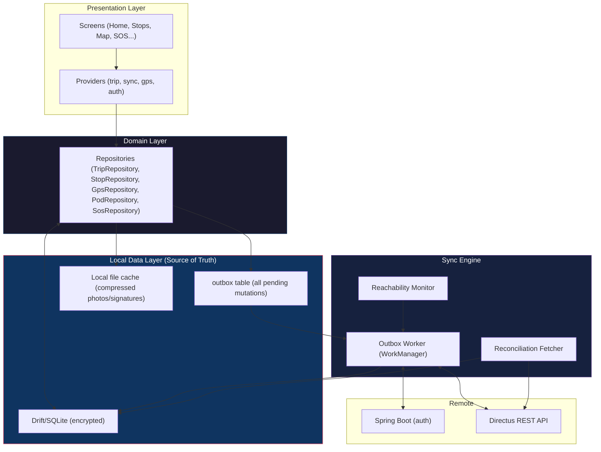
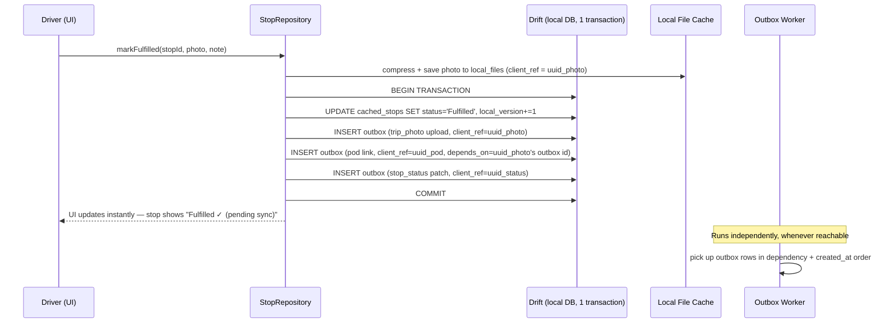

# 🔌 VOSRoute — Offline-First Architecture Implementation

> **Status**: Proposed (supersedes §13 "Offline-First Architecture" of `VOSRoute-Documentation.md`)
> **Date**: July 7, 2026
> **Scope**: Replaces the cache-and-queue sketch in the base documentation with a fully specified, testable offline-first architecture: local-first data layer, transactional outbox, idempotent sync engine, conflict resolution, and secure on-device storage.
> **Assumption**: The app is free to adjust its structure (packages, folder layout, DB schema) to support this design — nothing here is constrained to the original Phase 1–3 plan.

---

## 1. Why the Original Design Isn't Enough

The base documentation (§13) describes the right *intent* — cache on dispatch, queue writes, flush on reconnect — but as written it has failure modes that will surface in the field:

| Gap in §13 | Real-world consequence |
|---|---|
| Screens read from Directus directly (§11.1), SQLite is only a write queue | App shows a blank/error screen the moment connectivity drops mid-trip, even though the trip was already cached |
| No client-generated IDs for offline-created records (POD, ad-hoc stops, SOS) | If a flush request times out but actually succeeded server-side, retry creates a **duplicate** record |
| No per-record sync status | Driver has no way to tell "did my POD photo actually upload?" vs. "still pending" |
| "Flush on reconnect" implies a single connectivity boolean | A phone can report "connected" to Wi-Fi with no real internet (captive portal), or have a flapping signal on a highway — naive `connectivity_plus` listening will thrash |
| No retry/backoff policy | A single failed request (e.g., 500 from Directus) either blocks the whole queue or is silently dropped |
| No schema versioning strategy | First production DB migration will require a destructive app reinstall |
| No file compression / local file lifecycle | Multiple full-resolution photos per stop will fill device storage and slow uploads on cellular |
| Plaintext JWT in `SharedPreferences`, plaintext SQLite | Any rooted/lost device exposes trip, customer, and location data |
| GPS queue and POD/photo queues are separate concepts with duplicated retry logic | Harder to reason about, test, and monitor sync health as a whole |

The architecture below addresses each of these directly.

---

## 2. Core Principles

1. **SQLite is the single source of truth for the UI.** Every screen reads from the local database via a `Repository`, never directly from Directus/Spring Boot. Network calls only ever *populate* or *reconcile* the local store.
2. **All mutations are commands, not requests.** A driver action (mark stop fulfilled, add ad-hoc stop, upload POD, send SOS) is first written to local storage as a durable, idempotent **outbox entry**, inside the same DB transaction as the local state change it represents. The UI updates immediately from that local write — the network call happens asynchronously, invisibly, later.
3. **Idempotency by construction.** Every record the app creates offline gets a client-generated UUID (`client_ref`) at creation time. The server-side create endpoints are called with that UUID embedded (e.g., in `remarks`/a dedicated field, or de-duped by the sync engine checking-before-create), so a retried request can never produce a duplicate row.
4. **Sync is a state machine per record, not a boolean per queue.** Every outbox entry moves through `pending → in_flight → synced | failed(retryable) | failed(permanent)`, independently retryable, independently observable.
5. **Server truth wins for trip/stop *status transitions* the driver doesn't own; driver truth wins for the artifacts they created.** This mirrors §13.3 but is now enforced mechanically (see §7).
6. **The network is not binary.** "Online" means *verified reachability of the actual backend*, not just an OS-level connectivity event.
7. **Everything durable survives process death.** GPS ticks, sync flushes, and file uploads must resume correctly whether the app was backgrounded, killed by the OS, or the device rebooted mid-trip.

---

## 3. Updated Technology Additions

These are **additions/replacements** to §14.1 of the base doc, not a full stack replacement.

| Concern | Original choice | Revised choice | Why |
|---|---|---|---|
| Local DB | `sqflite` (raw SQL) | `drift` (on top of `sqflite`) | Compile-time-checked schema, typed DAOs, built-in migration runner (`MigrationStrategy`), reactive streams (`watch()`) that let repositories push local changes straight to the UI |
| DB encryption | none specified | `sqlcipher_flutter_libs` + `drift`'s `SqlCipher` executor | Encrypts the on-disk DB file; trip, customer, and GPS data unreadable if the device is lost |
| Secure token storage | `SharedPreferences` | `flutter_secure_storage` | JWT and Directus static token stored in Android Keystore-backed storage instead of plaintext prefs |
| Connectivity signal | `connectivity_plus` alone | `connectivity_plus` **+ active reachability probe** | Distinguishes "has a radio link" from "can actually reach Spring Boot/Directus" |
| Background execution | `flutter_background_service` (GPS only) | `flutter_background_service` for GPS **+ `workmanager`** for sync flush | `workmanager` guarantees periodic/deferred execution survives app kill via native `WorkManager` (Android), independent of whether the foreground service is alive |
| Retry/backoff | unspecified | `retry` package (exponential backoff + jitter), capped at a max interval | Avoids hammering the server after an outage and avoids battery drain from tight retry loops |
| IDs for offline-created records | server auto-increment only | `uuid` package generating a `client_ref` at creation time | Enables idempotent create + safe retries |
| Image handling | `image_picker` only | `image_picker` + `flutter_image_compress` | Compresses photos client-side (resize + JPEG quality) before they ever touch the outbox, cutting storage and upload time |
| Sync observability | none | in-app "Sync Log" screen backed by a `sync_log` table | Lets drivers and support staff see exactly what's pending/failed and why, without needing server access |

---

## 4. Layered Architecture



**Rule of thumb**: a `Screen` never imports `Dio` or talks to `ApiService` directly. It only talks to a `Repository`, which decides what's local vs. remote. This is the single biggest structural change from the original folder layout.

---

## 5. Revised Local Schema (Drift)

All tables below live in the encrypted local database. Naming intentionally mirrors the Directus collections in §10 so mapping is obvious, with sync-specific columns added.

### 5.1 Cached read-model tables (mirror server collections)

```
cached_trips                 -- 1 row per post_dispatch_plan, full JSON snapshot + normalized columns for querying
cached_stops                 -- unifies post_dispatch_invoices / _purchases / _plan_others into one polymorphic table
                              --   (type: 'invoice' | 'purchase' | 'other'), with server_id nullable until synced
cached_budget_lines          -- post_dispatch_budgeting, read-only
cached_crew                  -- post_dispatch_plan_staff, read-only
cached_driver_profile        -- user + vehicle context
```

Each cached table carries:
| Column | Purpose |
|---|---|
| `server_id` | Nullable. Null until the record exists on the server (e.g., a driver-created ad-hoc stop before sync). |
| `client_ref` | UUID generated on-device. Always present. Used to match local rows to server rows post-sync. |
| `last_synced_at` | Timestamp of last successful reconciliation from server. |
| `local_version` | Monotonic integer, incremented on every local mutation — used for optimistic-concurrency comparisons during reconciliation. |

### 5.2 The Outbox (replaces §13's five separate queue tables)

```sql
CREATE TABLE outbox (
  id               INTEGER PRIMARY KEY AUTOINCREMENT,
  client_ref       TEXT NOT NULL UNIQUE,      -- idempotency key sent to server
  entity_type      TEXT NOT NULL,             -- 'gps_log' | 'pod' | 'trip_photo' | 'ad_hoc_stop' | 'stop_status' | 'sos_report' | 'trip_transition'
  entity_local_id  INTEGER,                   -- FK into the relevant cached_* table, nullable for pure-append entities like gps_log
  payload_json     TEXT NOT NULL,             -- fully-formed request body, built at write-time (not read lazily at sync-time)
  depends_on       INTEGER,                   -- FK to another outbox.id — e.g. a POD upload must wait for its trip_photo's file upload to finish
  status           TEXT NOT NULL DEFAULT 'pending', -- pending | in_flight | synced | failed_retryable | failed_permanent
  attempt_count    INTEGER NOT NULL DEFAULT 0,
  next_attempt_at  DATETIME NOT NULL DEFAULT CURRENT_TIMESTAMP,
  last_error       TEXT,
  created_at       DATETIME NOT NULL DEFAULT CURRENT_TIMESTAMP,
  synced_at        DATETIME
);
```

**Why one table instead of five queues:** a single worker loop, a single retry policy, a single place to show sync health, and native support for **ordering dependencies** (e.g., a POD photo file must finish uploading — and return a Directus file UUID — before the `post_dispatch_nte` link row can be created; `depends_on` encodes that without ad-hoc coordination code).

### 5.3 Local file cache

```
local_files (
  id            TEXT PRIMARY KEY,      -- same client_ref used by the related outbox entry
  local_path    TEXT NOT NULL,         -- app sandbox path, e.g. app_docs/pod/<uuid>.jpg
  purpose       TEXT NOT NULL,         -- 'pod' | 'signature' | 'trip_photo_outbound' | 'trip_photo_inbound' | 'sos_photo'
  compressed    INTEGER NOT NULL,      -- 0/1
  uploaded      INTEGER NOT NULL DEFAULT 0,
  remote_uuid   TEXT,                 -- Directus file UUID once uploaded
  created_at    DATETIME NOT NULL
)
```

Photos are compressed (max long-edge 1600px, JPEG quality 80) immediately at capture time, **before** being written to `local_files` — this bounds storage and upload time regardless of the device's camera resolution.

### 5.4 Sync log (observability)

```
sync_log (
  id            INTEGER PRIMARY KEY AUTOINCREMENT,
  outbox_id     INTEGER,
  event         TEXT,      -- 'attempt' | 'success' | 'failure' | 'gave_up'
  detail        TEXT,
  occurred_at   DATETIME
)
```

Surfaced in a **Sync Log** screen under "More" — this is what a driver or a support person opens when someone says "my delivery didn't show up on the dashboard."

---

## 6. Write Path: How a Driver Action Becomes Durable

Example — **marking a delivery stop "Fulfilled" with a POD photo**, entirely offline:



The driver never waits on the network. The UI is driven entirely by the `COMMIT` in step above via a `drift` reactive `watch()` query — connectivity is irrelevant to perceived responsiveness.

---

## 7. Sync Engine

### 7.1 Reachability, not just connectivity

```dart
// Simplified shape
class ReachabilityMonitor {
  // 1. connectivity_plus tells us a radio link exists (cheap, event-driven)
  // 2. On any change, or every 20s while a link exists, do a lightweight
  //    HEAD/GET against a known-cheap endpoint (e.g. Directus /server/health)
  // 3. Debounce: require 2 consecutive successful probes before declaring
  //    "reachable" to avoid thrashing the worker on flaky signal
  Stream<bool> get isReachable;
}
```

This prevents the classic failure mode of "Wi-Fi connected, captive portal page, all requests silently fail" being misreported as online.

### 7.2 Outbox Worker

Triggered by three sources, all converging on the same worker function:
1. `ReachabilityMonitor` transitioning false → true.
2. `workmanager` periodic task (every ~15 minutes, the Android platform floor) — a safety net if the reachability transition was missed while the app was killed.
3. Manual "Sync now" pull-to-refresh action from the driver.

Worker loop, per pending outbox row (ordered by `depends_on` then `created_at`):

```
1. If row.depends_on exists and that row isn't 'synced' yet → skip for now.
2. If row.next_attempt_at is in the future → skip (backoff not elapsed).
3. Mark row 'in_flight'.
4. Execute the network call for entity_type, using payload_json
   (for file uploads: read local_files.local_path, POST to Directus /files,
    store remote_uuid, mark local_files.uploaded=1, then substitute remote_uuid
    into any dependent row's payload_json before it runs).
5. On 2xx  → mark 'synced', stamp synced_at, log to sync_log.
6. On 4xx (non-auth) → mark 'failed_permanent' (bad payload won't fix itself on
   retry) → surface in Sync Log + local notification asking driver to review.
7. On 401  → refresh JWT via Spring Boot refresh flow, requeue immediately
   (does not count as a failed attempt).
8. On 5xx / timeout / network error → mark 'failed_retryable', increment
   attempt_count, set next_attempt_at = now + backoff(attempt_count):
       backoff(n) = min(cap, base * 2^n) + random_jitter
       base = 5s, cap = 15 min
9. Log every attempt to sync_log regardless of outcome.
```

### 7.3 Idempotent server-side semantics

For each `entity_type`, the create call embeds `client_ref` so a duplicated retry is a no-op server-side:

| Entity | Idempotency approach |
|---|---|
| `gps_log` | Append-only + naturally idempotent-safe in practice, but still carries `client_ref` in payload for dedup/debugging. |
| `ad_hoc_stop` | Directus create call includes `client_ref` in `post_dispatch_plan_others`. Worker first does a cheap existence check (`GET .../post_dispatch_plan_others?filter[client_ref][_eq]=...`) before POSTing, in case a prior attempt actually succeeded but the response was lost. |
| `pod` / `trip_photo` | File upload keyed by `local_files.remote_uuid` — if already set (from a prior partially-successful attempt), skip re-upload and go straight to the link-record step. |
| `stop_status` | PATCH is naturally idempotent (same target state). |
| `sos_report` | Same existence-check pattern as ad-hoc stops — critical, since duplicating an emergency report is worse than a normal record. |
| `trip_transition` (departure/arrival) | Existence check via re-fetching the trip's current status before PATCHing — if already in the target status, skip. |

> **Note**: this requires adding a `client_ref` column to `post_dispatch_plan_others`, `post_dispatch_nte`, `post_dispatch_trip_photos`, and `fleet_emergency_reports` in Directus/MySQL — the one schema change this design asks of the backend, and it is additive/nullable, so it's non-breaking for existing web-dispatcher flows.

### 7.4 Conflict Resolution Matrix

Replaces the prose in §13.3 with explicit rules the reconciler enforces:

| Field / Entity | Authority | Rule |
|---|---|---|
| Stop status (`Fulfilled`, etc.) | Driver | Local write always wins; reconciler never overwrites a locally-pending stop status with a server value until the outbox entry for it is `synced`. |
| Trip-level status (`For Dispatch → For Inbound → For Clearance → Posted`, `Cancelled`) | Dispatcher (web) *except* the two transitions the driver is allowed to trigger | If the reconciler fetches a trip and finds the server status is `Cancelled` while the driver has pending offline actions, the app **halts further local mutation on that trip**, surfaces a blocking banner ("This trip was cancelled by dispatch"), and preserves already-queued outbox entries as `failed_permanent` for audit rather than silently sending them. |
| POD photos / trip photos | Driver (append-only) | No conflict possible — driver-authored artifacts are never overwritten by reconciliation, only added to. |
| GPS logs | Driver (append-only) | No conflict possible. |
| Budget lines | Dispatcher/web (read-only in app) | Reconciler always overwrites local cache with server value. |
| Ad-hoc stops the driver added while offline, if a dispatcher also modified the trip's stop sequence in the meantime | Driver's stop is preserved; sequence numbers are **re-derived, not trusted verbatim**, by appending after the highest existing sequence at sync time, then the driver is shown the actual final order for confirmation. |

---

## 8. Cross-Cutting Concerns

### 8.1 Security
- **Database**: `drift` configured with the `SqlCipher` executor; passphrase derived from a key stored in `flutter_secure_storage` (Android Keystore-backed), generated on first launch, never transmitted.
- **Tokens**: JWT (`vos_access_token`) and the Directus static token move from `SharedPreferences` to `flutter_secure_storage`.
- **Photos at rest**: stored in the app sandbox (not shared/external storage), removed from `local_files` once `uploaded=1` **and** the record has been reconciled as `synced` for at least 24h (short retention window in case a re-upload is ever needed), to bound disk usage.

### 8.2 Background durability
- GPS ticking: unchanged from §14.1 (`flutter_background_service`), but each tick now writes directly into the `outbox` (`entity_type='gps_log'`) instead of a bespoke `gps_queue` table, so it benefits from the same worker/backoff/observability as everything else.
- Sync flush: driven by `workmanager`'s native scheduler so it survives the Flutter engine/app process being killed by the OS — the original `flutter_background_service`-only approach in §14.1 does not guarantee this on all Android OEM battery-optimization profiles (a real risk in a fleet of mixed Android devices).

### 8.3 Schema migrations
`drift`'s generated `MigrationStrategy` is used from day one (even for schema v1), so every future field addition (e.g., the `client_ref` columns in §7.3) ships as an `onUpgrade` step instead of a destructive reinstall.

### 8.4 App-kill / crash recovery
Because the outbox and cached tables are the actual source of truth (not in-memory state), relaunching the app after a crash mid-trip requires no special recovery code — the UI simply re-renders from whatever the DB last committed, and the worker resumes any `in_flight` rows (reset to `pending` on app start, since an in-flight row from a killed process is indistinguishable from a lost request and must be treated as not-yet-confirmed... re-checked via the idempotency existence-check in §7.3 before resubmitting).

---

## 9. Revised Folder Structure

Delta from §15 of the base doc — new/changed items marked:

```
lib/
├── db/
│   ├── app_database.dart          # drift database, SqlCipher setup            [NEW: drift-based]
│   ├── tables/
│   │   ├── cached_trips_table.dart
│   │   ├── cached_stops_table.dart
│   │   ├── outbox_table.dart                                                    [NEW]
│   │   ├── local_files_table.dart                                               [NEW]
│   │   └── sync_log_table.dart                                                  [NEW]
│   └── migrations.dart                                                          [NEW]
├── repositories/                                                                [NEW LAYER]
│   ├── trip_repository.dart        # only class screens/providers may call
│   ├── stop_repository.dart
│   ├── gps_repository.dart
│   ├── pod_repository.dart
│   └── sos_repository.dart
├── sync/                                                                        [NEW]
│   ├── reachability_monitor.dart
│   ├── outbox_worker.dart
│   ├── idempotency.dart            # existence-check helpers per entity_type
│   ├── backoff.dart
│   └── reconciler.dart             # periodic re-fetch + conflict resolution
├── services/
│   ├── api_service.dart            # now called ONLY from sync/ and repositories/
│   ├── auth_service.dart           # token storage moved to flutter_secure_storage
│   ├── image_service.dart          # capture + compression                      [NEW]
│   └── notification_service.dart
├── providers/
│   ├── trip_provider.dart          # now just exposes repository streams
│   ├── sync_provider.dart          # backed by outbox/sync_log watch queries
│   └── ...
└── screens/
    ├── ...
    └── sync_log_screen.dart                                                      [NEW]
```

---

## 10. Testing Strategy

| Layer | Approach |
|---|---|
| Outbox state machine | Pure unit tests: given a sequence of network responses (200/401/500/timeout), assert the row ends in the correct terminal/backoff state and `next_attempt_at` matches the expected backoff curve. |
| Idempotency | Unit tests simulating "request succeeded server-side but response lost" (mock returns a network error, but a subsequent existence-check call returns the record) → assert no duplicate create call is made. |
| Repositories | Widget/integration tests asserting screens render correctly from a seeded local DB with **zero** network available — proves the "local is source of truth" rule actually holds. |
| Reconciliation/conflict rules | Table-driven tests, one per row of the matrix in §7.4. |
| Chaos/manual QA | A debug-only "Network Chaos" panel (toggle offline, inject latency, force 500s) added to Settings for Phase 3 QA — lets testers execute a full trip lifecycle offline and verify it reconciles correctly on reconnect, without needing to physically walk out of Wi-Fi range. |

---

## 11. Migration Plan Against the Existing Phase 3 Plan

This slots into the base documentation's §17 Phase 3 ("Full Offline-First + SOS") as a direct replacement of its implementation approach, same verification goal:

| Original Phase 3 item | Replaced by |
|---|---|
| SQLite Local Database (raw sqflite cache) | `drift` schema in §5, encrypted |
| Offline Queues (5 separate tables) | Single `outbox` table, §5.2 |
| Background GPS Service | Unchanged mechanism, now writes into `outbox` |
| Background Sync | `workmanager` + `ReachabilityMonitor`, §7.1–7.2 |
| SOS/Emergency Feature | Unchanged UX, now routed through `SosRepository` → outbox like everything else |
| Trip History | Unchanged; now trivially served from `cached_trips` with no separate "history" fetch logic needed |

**Backend change required**: add nullable `client_ref VARCHAR(64)` to `post_dispatch_plan_others`, `post_dispatch_nte`, `post_dispatch_trip_photos`, and `fleet_emergency_reports` (Directus + MySQL) to support the idempotency existence-checks in §7.3. This is the only server-side change; everything else in this document is app-side.

**Verification** (extends the original Phase 3 verification): turn off connectivity → complete a full trip including an ad-hoc stop and a POD photo → force-kill the app mid-trip → relaunch → confirm UI state is unchanged and nothing was lost → reconnect → confirm each outbox entry reaches `synced` exactly once (no duplicate rows server-side) → open Sync Log and confirm every action is accounted for.
