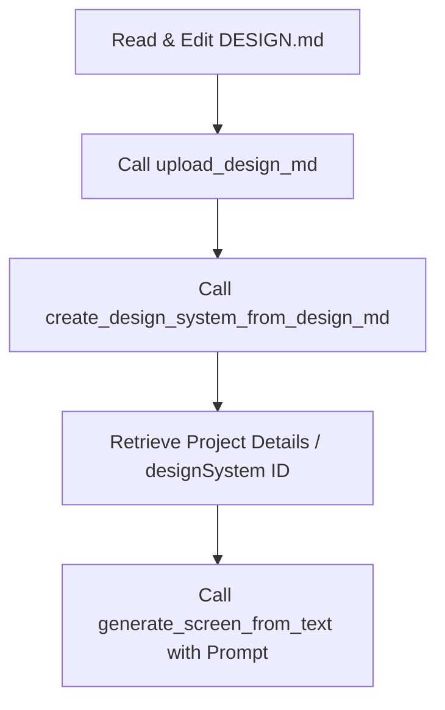

# Google Stitch Prototyping Guide for VOSRoute UI/UX Modernization

This document provides a comprehensive guide on using **Google Stitch** (Google Labs' AI-native design canvas and prototyping platform) to modernize the user interface of the **VOSRoute** fleet dispatch mobile app. It outlines how to define a design system using the `DESIGN.md` specification and how to construct prompts that yield pixel-perfect, highly accurate prototypes.

---

## 1. What is Google Stitch?

**Google Stitch** is an experimental AI-powered design platform from Google Labs that bridges the gap between natural language concepts and interactive UI prototypes.
* **Vibe Prototyping:** Allows designers and developers to generate layouts, micro-interactions, and functional frontend views by describing the target aesthetic and user intent.
* **Agent-Friendly Design System (`DESIGN.md`):** It establishes a standardized Markdown format featuring YAML front matter to define design tokens (colors, shapes, typography, spacing) followed by rich prose detailing brand rules. AI agents (like Stitch, v0, or custom LLMs) read this file to enforce pixel-perfect consistency across all generated views.
* **Multi-Platform Prototyping:** Generates responsive screens (Mobile, Desktop, Tablet) and exports code or high-fidelity assets compatible with Figma (preserving Auto Layout) and frontend UI frameworks.

---

## 2. Setting Up a Modern Look for VOSRoute

To elevate VOSRoute from its current functional layout to a premium, modern mobile app design, the prototype must adhere to these aesthetics:

### Core Aesthetics
1. **Glassmorphism & Depth:** Use layered semi-transparent cards, subtle background blurs, and soft shadows to establish depth.
2. **Dynamic Contrast & Sleek Dark Mode:** A deep, near-black backdrop (`#080810`) combined with a vibrant primary accent (`#3B6EF0` for dark mode, `#1D4ED8` for light mode).
3. **Pill-Shaped and Rounded Elements:** Broad corner radii (`ROUND_TWELVE` or `ROUND_FULL` for chips/pills) to replace boxy, dated components.
4. **Rich Typography Hierarchy:** Modern, clean sans-serif typography like **Plus Jakarta Sans** or **Manrope** for headers, and **Inter** for data-dense tables/lists.
5. **Micro-Animations & Visual Anchors:** Status chips with glowing indicators (green for Fulfilled, orange for Dispatch, etc.) that instantly draw the driver's eye.

---

## 3. The `DESIGN.md` Source of Truth for Stitch

The `DESIGN.md` file serves as the core instruction manual for Stitch. It must be uploaded to Stitch before generating screens to ensure the AI uses VOSRoute's exact brand identities instead of generic colors or shapes.

Here is the exact `DESIGN.md` configuration tailored for the modern VOSRoute UI. You can copy this template into a file named `DESIGN.md` and upload it to Stitch.

```markdown
---
name: VOSRoute Modern Fleet Design System
theme:
  # General Settings
  colorMode: "DARK"                  # Set to DARK as default to fit the driver night-friendly HUD aesthetic
  headlineFont: "PLUS_JAKARTA_SANS"  # High-impact modern geometric sans-serif for headings
  bodyFont: "INTER"                  # Neutral, readable font for dense data lists
  labelFont: "MANROPE"               # Clean font for metadata and small button labels
  roundness: "ROUND_TWELVE"          # Modern roundness (12px) for cards, dialogs, and inputs
  customColor: "#3B6EF0"             # Main brand blue seed color
  colorVariant: "VIBRANT"            # Dynamic color variant for premium visual energy
  
  # Exact Override Hex Colors (VOSRoute Brand Palette)
  overridePrimaryColor: "#3B6EF0"    # VOS brand blue for main interactive elements
  overrideNeutralColor: "#080810"    # Deepest background color for dark mode
  overrideSecondaryColor: "#0F0F1A"  # Slightly lighter container/card background
  overrideTertiaryColor: "#1A1A22"   # Elevated elements, secondary buttons
  
  # Semantic Alerts
  successColor: "#22C55E"            # Positive / Fulfilled status
  errorColor: "#EF4444"              # Alert / Urgent / Unfulfilled status
  warningColor: "#F97316"            # Inbound / Action required status
  infoColor: "#3B82F6"               # For Dispatch / General status
  
  # Modern Grid Spacing
  spacing:
    xxs: "4px"
    xs: "8px"
    sm: "12px"
    md: "16px"
    lg: "24px"
    xl: "32px"
    
  # Typography Tokens
  typography:
    display-lg:
      fontFamily: "Plus Jakarta Sans"
      fontSize: "28px"
      fontWeight: "700"
      lineHeight: "1.2"
      letterSpacing: "-0.02em"
    title-md:
      fontFamily: "Plus Jakarta Sans"
      fontSize: "18px"
      fontWeight: "600"
      lineHeight: "1.4"
    body-md:
      fontFamily: "Inter"
      fontSize: "14px"
      fontWeight: "400"
      lineHeight: "1.5"
    label-sm:
      fontFamily: "Manrope"
      fontSize: "12px"
      fontWeight: "600"
      lineHeight: "1.3"
      letterSpacing: "0.05em"
---

# VOSRoute Design Guidelines

## Visual Style & Identity

### 1. Depth & Glassmorphism
All cards and containers representing trip stops, emergency actions, and status overviews must use subtle background layering:
* Card base background is `#0F0F1A` over the deep canvas backdrop of `#080810`.
* Outlines and borders must be thin, crisp, and color-matched to `#1F1F27`.
* Use a light overlay or glassmorphic tint on active states.

### 2. Status Indicator Chips
Fleet dispatch depends heavily on status visibility. Keep these indicators highly visible but premium:
* Chips must be fully rounded (`ROUND_FULL`).
* Use a soft, semi-transparent background colored after the status type, with a solid, vibrant dot indicator inside (e.g., a green dot for "Posted").
* Status maps:
  - **For Dispatch:** Soft Blue fill, solid `#3B82F6` text & dot.
  - **For Inbound / Warning:** Soft Orange fill, solid `#F97316` text & dot.
  - **Posted / Success:** Soft Green fill, solid `#22C55E` text & dot.
  - **For Clearance:** Soft Yellow fill, solid `#EAB308` text & dot.

### 3. Typography & Hierarchy
Never use pure black or pure white text directly. Use the brand's typographic hierarchy:
* **Primary Text:** `#FAFAFA` (nearly white, high contrast)
* **Secondary Text:** `#ADADB8` (muted grey for metadata and secondary info)
* **Tertiary Text:** `#6B6B7A` (darker grey for inactive labels or timestamps)
* Titles should use `Plus Jakarta Sans` for a premium, technical aesthetic, while lists/values use `Inter` for clarity.

### 4. Interactive Components
* **Buttons:** Primary CTA buttons are solid `#3B6EF0` with bold text. Secondary buttons are outline-only or use `#1A1A22` as a backdrop.
* **Input Fields:** Input bars must use `#0F0F1A` filled background, rounded corners (`ROUND_TWELVE`), and a vibrant outline (`#3B6EF0`) only when focused.
* **Iconography:** Use crisp, linear, modern icons (e.g., Feather or Lucide outline style). Avoid filled, heavy icons unless indicating active selection.
```

---

## 4. Stitch API / Tool Operations

To programmatically have Stitch ingest the design system and output accurate prototypes, use the following sequence of StitchMCP tools:



### Step 1: Upload the Markdown File
Call `upload_design_md` with your base64-encoded `DESIGN.md` file:
* **Parameter:** `projectId` (e.g., `'4044680601076201931'`)
* **Parameter:** `designMdBase64` (Base64-encoded string of the `DESIGN.md` content shown in Section 3)

### Step 2: Initialize/Update the Design System
Immediately after, call `create_design_system_from_design_md`:
* **Parameter:** `projectId`
* **Parameter:** `selectedScreenInstance` (The screen instance ID returned by the upload action)
* This step will parse the YAML tokens and prose, creating an active design system ID (e.g., `assets/15996705518239280238`).

### Step 3: Screen Prototyping
Generate the modernized screens using `generate_screen_from_text`:
* **Parameter:** `projectId`
* **Parameter:** `designSystem` (Provide the parsed design system ID)
* **Parameter:** `deviceType` (Set to `MOBILE` for the VOSRoute application)
* **Parameter:** `prompt` (Provide a highly descriptive UI prompt)

---

## 5. Screen Prompting Guidelines for Modern UI

To guarantee that Stitch outputs a modern, premium UI rather than a generic template, your generation prompts must specify:
1. **Layout Grid:** Define spacing, card structures, and scroll directions.
2. **Context:** Specify that this is a professional driver mobile app (HUD style).
3. **Styling Clues:** Reference "glassmorphism", "rounded cards", "neon-like status glow", and "Plus Jakarta Sans typography".
4. **Interactive States:** Describe buttons, chips, and fields.

### Modern Prompt Templates for VOSRoute

Here are copy-pasteable prompts you can feed into `generate_screen_from_text` (or the Stitch canvas UI):

#### A. Modern Fleet Dispatch Dashboard (Stop List Screen)
> "Create a modern, premium mobile dashboard screen for a driver dispatch app using the loaded VOSRoute Dark Theme. The canvas background is deep dark `#080810`. The top section has a glassmorphic header with a subtle horizontal border `#1F1F27` containing a welcoming status bar: 'Driver Status: Active' inside a small, pill-shaped green glowing status chip. The body is a scrollable list of stop cards. Each stop card is a dark rounded container (`#0F0F1A`, rounded 12px) featuring: left-aligned large, bold stop sequence number (e.g., '01', '02') in Plus Jakarta Sans typography, stop address, and a pill chip indicating trip status (e.g., 'For Dispatch' with light blue translucent fill and solid blue text). Bottom navigation bar is sleek, semi-transparent, and flat, highlighting the 'Trips' tab in brand blue `#3B6EF0`."

#### B. Trip Detail & Digital Proof of Delivery (POD) Approval
> "Create a high-fidelity mobile detail screen for trip verification and signature capture on dark theme. Background `#080810`. Content is structured in clean cards (`#0F0F1A`, border `#1F1F27` 1px). Section 1 shows invoice details and status chips with color-coded dot badges (e.g. 'Fulfilled with Returns' in soft orange). Section 2 is a dedicated signature container: a clean, rounded empty card block styled as a glass canvas with a subtle dotted border, indicating 'Tap here to sign'. At the bottom, a prominent modern CTA button filled with VOS brand blue `#3B6EF0` reads 'Submit POD Approval'. Ensure spacing is airy and elements use 12px roundness."

#### C. Mobile Emergency Alert Screen (Driver SOS)
> "Create a modern emergency SOS alert screen for a driver mobile app. The UI is dark themed (`#080810`) but features a high-impact, soft glowing red warning card at the top. The center contains a massive, glowing, circular red SOS button with a pulsating border animation effect. Below the button, input fields with rounded-12px borders allow inputting a short description of the vehicle emergency. The layout is clean and minimal, with typography featuring large headings in Plus Jakarta Sans and description labels in Inter. Back navigation button at the top-left is a simple, modern arrow outline inside a small, semi-transparent circular card."

---

## 6. Implementing the Designs in Flutter

Once the prototypes are generated by Stitch, the frontend developer should map the output tokens directly to VOSRoute's codebase configuration files:

* **Colors:** Check [app_colors.dart](file:///c:/Users/HP/Desktop/Code/vertextech/ResearchDEPT/VOSRoute/lib/theme/app_colors.dart) and update brand gradients and surfaces to match the hexadecimal variables generated by Stitch.
* **Theme Styling:** In [app_theme.dart](file:///c:/Users/HP/Desktop/Code/vertextech/ResearchDEPT/VOSRoute/lib/theme/app_theme.dart), ensure that the `CardThemeData`, `ButtonThemeData`, and `InputDecorationTheme` utilize `BorderRadius.circular(12.0)` (mapping to Stitch's `ROUND_TWELVE`) and use correct focus borders.
* **Typography Scale:** Map the `display-lg`, `title-md`, and `body-md` configurations directly into [app_typography.dart](file:///c:/Users/HP/Desktop/Code/vertextech/ResearchDEPT/VOSRoute/lib/theme/app_typography.dart) for typography scaling.
